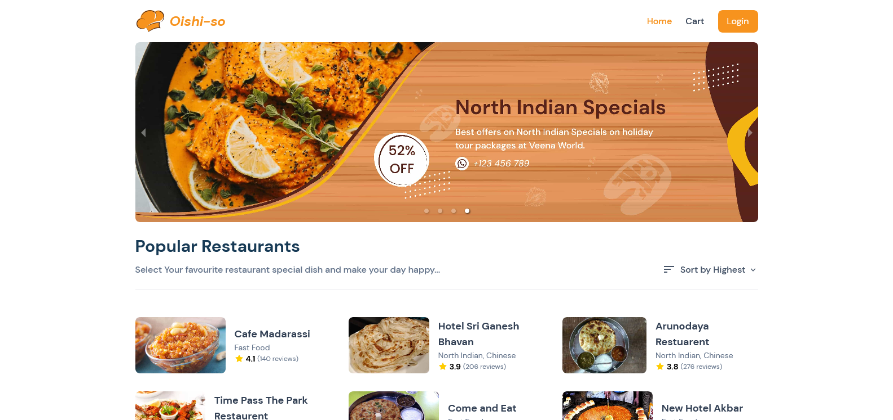

# Oishi-so

## About Oishi-so

**Oishi-so** is an online food App created with ReactJS.

### Tech Stack

- [ReactJS](https://reactjs.org)
- [TailwindCSS](https://tailwindcss.com/)
- Vercel for deployment

### Links

- [Live Site](https://oishi-so.vercel.app/)

## Project Source

You can check all the requirements for this project [here](https://reactjsexample.com/build-a-tasty-kitchens-app-with-react-js/).

## About Me

- Website - [Abam](https://abams.vercel.app/)
- Twitter - [@zabamz1](https://www.twitter.com/zabamz1)
- Instagram - [@zfaabam](https://www.instagram.com/zfaabam/)
- LinkedIn - [Zulfa Fatah Akbar Ahmad](https://www.linkedin.com/in/zulfa-fatah-akbar-ahmad/)
